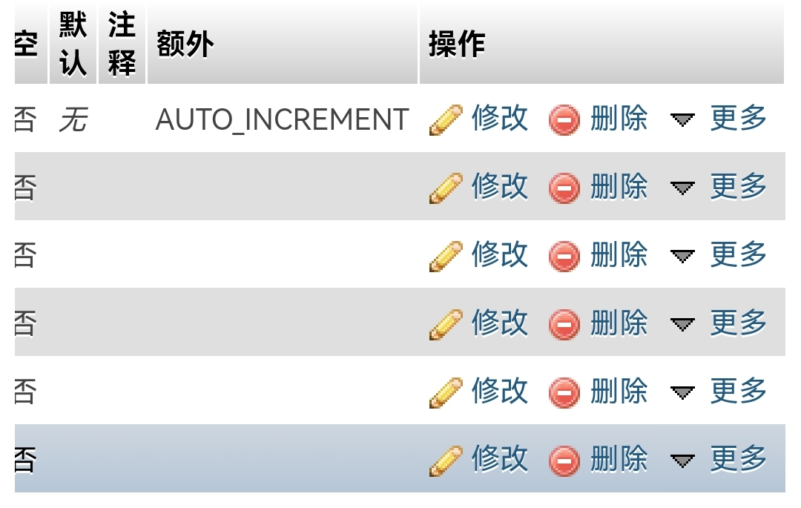

# Croe


[](https://github.com/WuoLun/Croe/blob/main/LICENSE)
[](https://github.com/WuoLun/Croe/issues)


Croe是一个开源的匿名信项目，通过一些匿名信件，来达到秘密传输心意的想法
## 优势
- 🗯官方询问支持
- 🔨高的可开发度
- 🔰支持AJAX
- 🔰支持数据库（Only 2.0.x）
- 🤭更多正在开发！

# 安装
推荐配置：
- PHP 7.0以上
- 服务器运存>=1GB

下载最新发行版安装包，解压至服务器目录

## 配置数据库
> 配置数据库为2.0.x的教程，2.1.x或以上可跳过配置数据库

使用前需要配置
### 链接数据库
前往文件`Connent/connent.php`后，输入相关信息

|变量名|相应信息|
|----|----|
|`$location`|数据库地址，默认127.0.0.1|
|`$user`|数据库链接用户名|
|`$key`|数据库链接密码|
|`$database`|数据库名|

> 默认链接数据库端口为3306，如果是其他端口，需要自行开发配置

### 创建数据表
前往自行输入的数据库，在相应数据库创建一个数据表名为`croe_users`

数据表配置预览




> id需要设置为自动序列，MySQL基础者都懂，其他不懂可以百度一下

## 配置邮箱
文件`Server/send.php`为邮箱配置文件，第**66-81**行为邮箱配置
### 配置预览
```php
// 设置发送的邮件的编码

$mail->CharSet = 'UTF-8';

// 设置发件人昵称 显示在收件人邮件的发件人邮箱地址前的发件人姓名

$mail->FromName = '';

// smtp登录的账号

$mail->Username = '';

// smtp登录的密码 或 使用生成的授权码

$mail->Password = '';

// 设置发件人邮箱地址 同登录账号

$mail->From = '';

// 邮件正文是否为html编码 注意此处是一个方法

$mail->isHTML(true);

$mail->addReplyTo('', 'info'); //回复的时候回复给哪个邮箱 建议和发件人一致

// 设置收件人邮箱地址
//方法POST不用修改，仅开发时可修改
$mail->addAddress($_POST['email']);

$mail->addAddress('');
```
# API
可前往[Wiki](https://github.com/WuoLun/Wiki/API)查看接口

### 帮助
你可提交issues，我们会在48小时内查看并回复！

