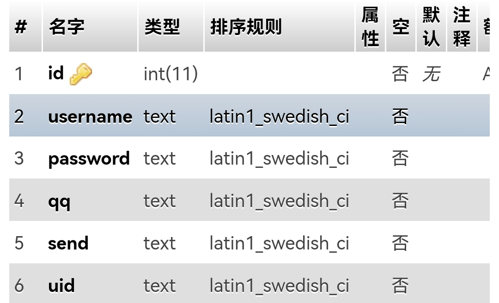

# Croe
Croe是一个开源的匿名信项目，通过一些匿名信件，来达到秘密传输心意的想法
## 优势
- ✴️代码完全开放
- 🗯官方询问支持
- 🔨高的可开发度
- 😎小的，快速的大小
- 🔰支持AJAX
- 🔰支持数据库
- 💐开发中......

# 安装
下载最新发行版安装包，解压至服务器目录
## 配置数据库
使用前需要配置
### 链接数据库
前往文件`Connent/connent.php`后，输入相关信息

|变量名|相应信息|
|----|----|
|`$location`|数据库地址，默认127.0.0.1|
|`$user`|数据库链接用户名|
|`$key`|数据库链接密码|
|`$database`|数据库名|

> 默认链接数据库端口为3306，如果是其他端口，需要自行开发配置

### 创建数据表
前往自行输入的数据库，在相应数据库创建一个数据表名为`croe_users`
数据表配置预览

### 帮助
你可提交issues，我们会在48小时内查看并回复！

